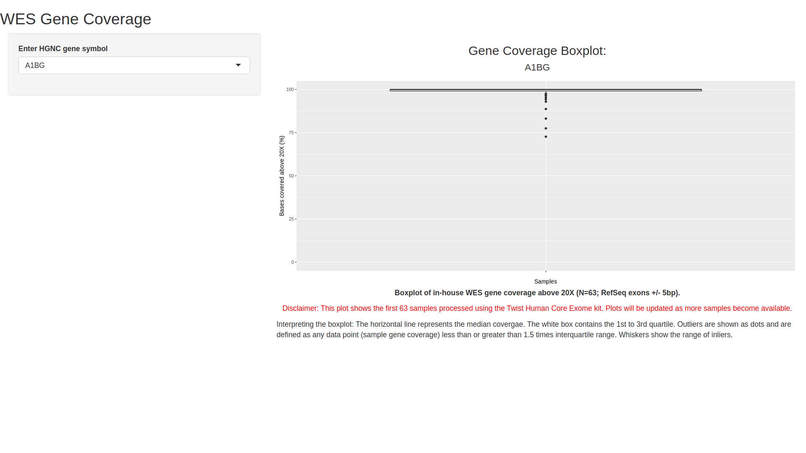

# coverage_boxplots

CovApp is a Shiny web app that shows gene coverage boxplot from in-house WES data. See [./CovApp/App.R](./CovApp/App.R) for application code.

## App Data

CovApp app generates plots using data from [covtidy.txt](./CovApp/covtidy.txt) and [covtidy_genes.txt](./CovApp/covtidy_genes.txt). `covtidy.txt` lists coverage above 20X for genes in multiple samples whereas `covtidy_genes.txt` lists unique genes in `covtidy.txt`. Both files are created from *.chanjo_txt files output by the WES pipeline (see [create_covtidy.py](./create_covtidy/create_covtidy.py)). `covtidy.txt` has three fields:

* Sample - Unique sample identifier

* above20X - Percentage gene coverage above 20X

* Gene - Approved HGNC symbol

## Deployment

CovApp is hosted at [shinyapps.io](https://docs.rstudio.com/shinyapps.io/getting-started.html).

## Contact

Viapath Genome Informatics.

