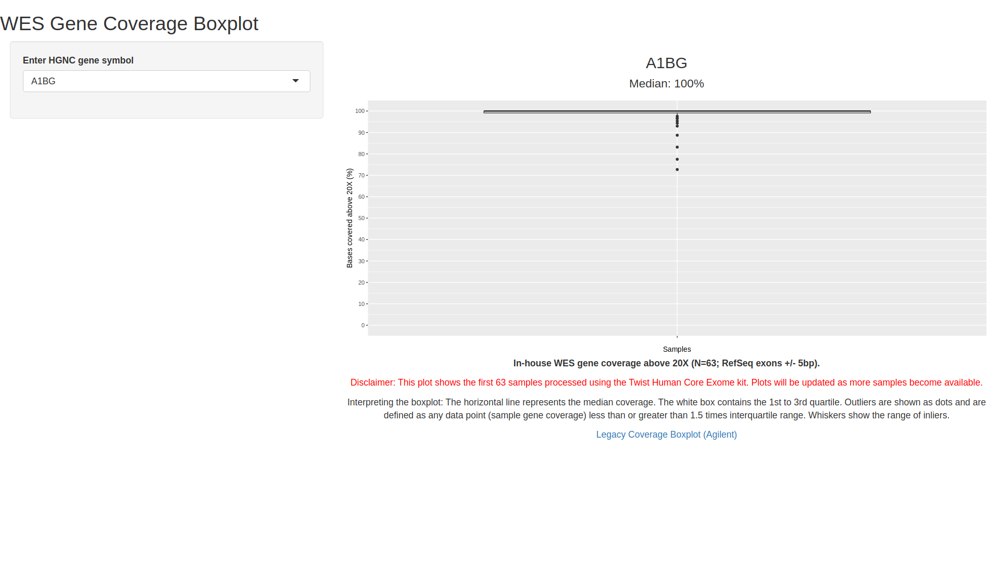

# CovApp v1.1

CovApp is an R shiny app that shows gene coverage boxplots for in-house WES data. See [./CovApp/App.R](./CovApp/App.R) for application code.

## Data Sources

CovApp app renders plots using three source files:

* `covtidy.txt` lists the percentage coverage above 20X for each gene in each sample.
* `covtidy_genes.txt` lists unique genes in covtidy.txt.
* `covtidy_median.txt` lists the median percentage coverage above 20X for each gene across all samples.

All three source files are generated by [create_covtidy.py](./create_covtidy/create_covtidy.py), a script that requires *.chanjo_txt files output by the WES pipeline.

## Deployment

CovApp is hosted at [shinyapps.io](https://docs.rstudio.com/shinyapps.io/getting-started.html).

## Contact

Viapath Genome Informatics.

